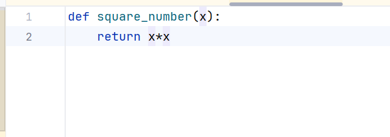
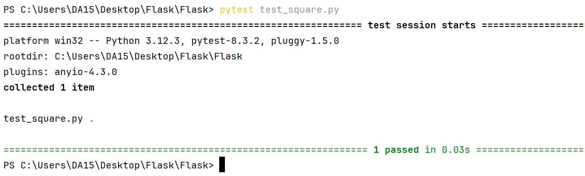
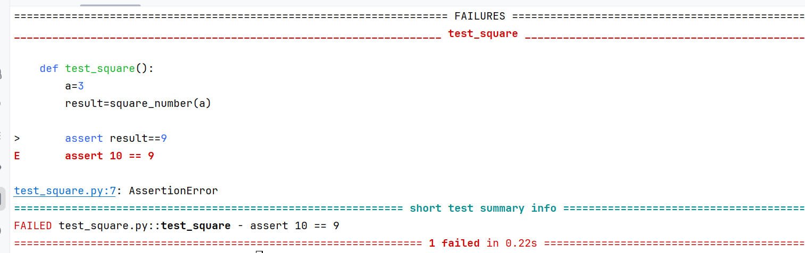

# Flask
 

Now we made some changes in the function and then wour test case is getting failed. The same way we create
the test cases for the model which we develope.

# Documentation for Flask Application Testing with pytest

**Overview**
This documentation covers the setup and execution of basic testing for a Flask application 
using the pytest framework. The purpose of these tests is to verify that the application’s routes return the expected status codes and responses.

**Prerequisites**

**Flask:** A micro web framework written in Python.
**pytest:** A testing framework that allows you to write simple and scalable test cases.
**Python:** The programming language used for this project.

**Files and Structure**

**app.py:** This file contains the Flask application code.
**test_app.py:** This file contains the test cases for the Flask application using pytest.

# Explanation
**1. Importing Required Modules**

**import pytest**: Imports the pytest framework, which is used for running the test cases. 
                   pytest simplifies the process of writing and executing tests and provides useful features like fixtures and test discovery.
**from app import app:** Imports the Flask application instance from the app.py file. 
                        This allows the test file to access the Flask app and simulate requests against it.

# 2. Setting Up a pytest Fixture

**@pytest.fixture:** A decorator that marks the **client()** function as a fixture. In pytest, fixtures are functions that are executed before the test functions to set up any state or resources required by the tests.

**client() function:** This function creates a test client for the Flask application using app.test_client(). The test client is a Flask-provided utility that simulates a client interacting with the application. It allows you to send HTTP requests to the application without having to run the server.

**Why use a fixture?** 
The fixture allows the creation of the test client to be shared across multiple tests. This promotes code reuse and ensures that each test starts with a fresh, 
isolated instance of the test client.

# 3. Defining a Test Case

**def test_home(client)::** This is the actual test case. It’s a Python function prefixed with test_, which is a naming convention recognized by pytest to identify test functions.

**client parameter:** The client parameter is passed into the function, which pytest automatically injects using the client fixture defined earlier.
**client.get('/'):** This line sends a GET request to the root ('/') of the Flask application using the test client. The request simulates what a browser would do when navigating to the home page of the application.

**resp variable:** Stores the response object returned by the client.get('/') call.

**assert resp.status_code == 200:** This assertion checks that the HTTP status code of the response is 200, which indicates that the request was successful. If the status code is anything other than 200, the test will fail.

**Why assert the status code?:** 
 Asserting the status code verifies that the route is working correctly and returning the expected response. In this case, a 200 status code indicates that the home page is accessible and functioning as expected.

# Conclusion
This basic test setup provides a foundation for verifying the functionality of a Flask 
application. By using pytest and Flask’s test client, you can simulate HTTP requests
to your application and validate that it responds as expected. This approach helps
catch errors early in the development process and ensures that your application behaves
correctly under different conditions
